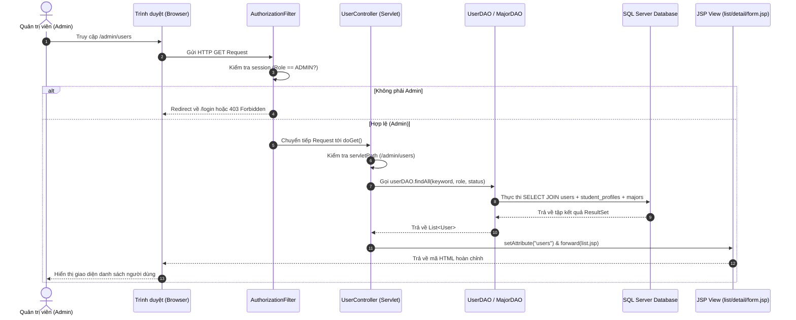
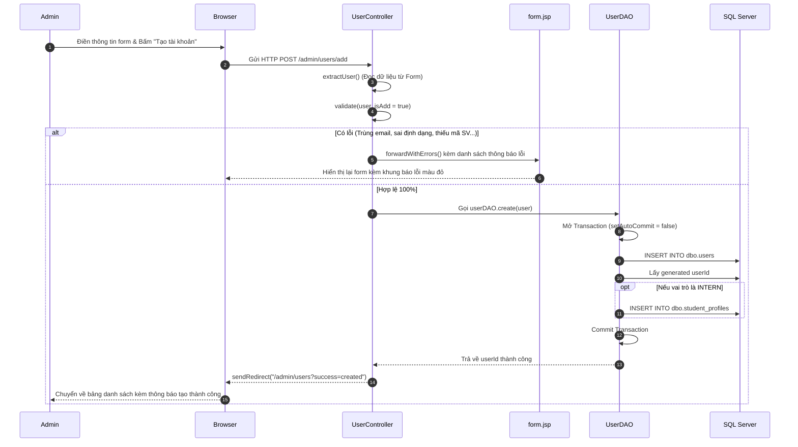

# 📚 TÀI LIỆU CHI TIẾT LUỒNG CODE MODULE QUẢN LÝ NGƯỜI DÙNG (FE-01 | USER MANAGEMENT)

Tài liệu này mô tả chi tiết toàn bộ kiến trúc, luồng dữ liệu (Data Flow) và giải thích cặn kẽ từng dòng mã nguồn trong Module **Quản lý người dùng (FE-01)** của hệ thống **LAB Asset Management**.

---

## 📑 MỤC LỤC
1. [Tổng quan kiến trúc & Các file thành phần](#1-tổng-quan-kiến-trúc--các-file-thành-phần)
2. [Sơ đồ tuần tự tổng quát (Sequence Diagram)](#2-sơ-đồ-tuần-tự-tổng-quát-sequence-diagram)
3. [Luồng 1: Xem danh sách, Tìm kiếm & Lọc (GET /admin/users)](#3-luồng-1-xem-danh-sách-tìm-kiếm--lọc-get-adminusers)
4. [Luồng 2: Xem chi tiết người dùng (GET /admin/users/view)](#4-luồng-2-xem-chi-tiết-người-dùng-get-adminusersview)
5. [Luồng 3: Thêm mới người dùng (GET & POST /admin/users/add)](#5-luồng-3-thêm-mới-người-dùng-get--post-adminusersadd)
6. [Luồng 4: Chỉnh sửa người dùng (GET & POST /admin/users/edit)](#6-luồng-4-chỉnh-sửa-người-dùng-get--post-adminusersedit)
7. [Luồng 5: Khóa / Kích hoạt tài khoản (GET /admin/users/toggle-status)](#7-luồng-5-khóa--kích-hoạt-tài-khoản-get-adminuserstoggle-status)
8. [Luồng 6: Đổi nhanh vai trò Mentor ⇄ Lab Manager (GET /admin/users/change-role)](#8-luồng-6-đổi-nhanh-vai-trò-mentor--lab-manager-get-adminuserschange-role)
9. [Bảo mật, Phân quyền & Quản lý Transaction CSDL](#9-bảo-mật-phân-quyền--quản-lý-transaction-csdl)

---

## 1. TỔNG QUAN KIẾN TRÚC & CÁC FILE THÀNH PHẦN

Module Quản lý người dùng được xây dựng theo mô hình **MVC (Model - View - Controller)** chuẩn trong Java Web Servlet/JSP:

```
[Trình duyệt Browser]
       │
       ▼ (HTTP Request)
[AuthorizationFilter.java] ── (Kiểm tra quyền ADMIN)
       │
       ▼
[UserController.java] (Servlet Controller - Điều phối nghiệp vụ & Validate)
   ┌───┴──────────────────────┐
   ▼                          ▼
[UserDAO.java]          [MajorDAO.java] (Tầng truy cập dữ liệu Database)
   │                          │
   └──────────┬───────────────┘
              ▼
    [Microsoft SQL Server]
       (dbo.users, dbo.student_profiles, dbo.majors)
              │
              ▼ (Model: User.java, Major.java)
       [UserController]
              │
              ▼ (Forward request attributes)
   [JSP Views: list.jsp / detail.jsp / form.jsp]
              │
              ▼ (HTML Rendered Response)
       [Trình duyệt Browser]
```

### 📁 Danh sách các tệp tin trong module:
1. **Controller:** `src/main/java/fpt/swp391/labtoolequip/controller/admin/UserController.java` (Servlet xử lý tất cả các route `/admin/users/*`).
2. **DAOs (Data Access Objects):**
   - `src/main/java/fpt/swp391/labtoolequip/dao/UserDAO.java` (Thao tác với bảng `dbo.users` và `dbo.student_profiles`).
   - `src/main/java/fpt/swp391/labtoolequip/dao/MajorDAO.java` (Lấy danh mục chuyên ngành từ bảng `dbo.majors`).
3. **Models (Java Beans):**
   - `src/main/java/fpt/swp391/labtoolequip/model/User.java` (Chứa thông tin người dùng, tài khoản và sinh viên).
   - `src/main/java/fpt/swp391/labtoolequip/model/Major.java` (Chứa thông tin chuyên ngành).
4. **Views (Giao diện JSP):**
   - `src/main/webapp/WEB-INF/views/admin/users/list.jsp` (Màn hình danh sách người dùng, thanh tìm kiếm & bộ lọc).
   - `src/main/webapp/WEB-INF/views/admin/users/detail.jsp` (Màn hình hồ sơ chi tiết của một người dùng).
   - `src/main/webapp/WEB-INF/views/admin/users/form.jsp` (Màn hình form Thêm mới và Chỉnh sửa người dùng).
   - `src/main/webapp/WEB-INF/views/admin/includes/sidebar.jspf` (Thanh điều hướng bên trái dành cho Admin).
5. **Bộ lọc bảo mật (Security Filter):**
   - `src/main/java/fpt/swp391/labtoolequip/auth/AuthorizationFilter.java` (Chặn các role khác không được vào URL `/admin/*`).

---

## 2. SƠ ĐỒ TUẦN TỰ TỔNG QUÁT (SEQUENCE DIAGRAM)



---

## 3. LUỒNG 1: XEM DANH SÁCH, TÌM KIẾM & LỌC (GET /admin/users)

### 📌 Điểm bắt đầu & Điểm kết thúc:
- **Bắt đầu:** Người dùng bấm vào menu **"Người dùng"** trên thanh Sidebar (`href="${pageContext.request.contextPath}/admin/users"`).
- **Kết thúc:** Trình duyệt nhận mã HTML từ `list.jsp` hiển thị bảng 8 cột thông tin người dùng kèm phân trang, tìm kiếm và bộ lọc.

---

### 💻 Chi tiết từng đoạn code & Giải thích:

#### 1. Tại `UserController.java` (Điều hướng Request):
```java
// Dòng 15-16: Khai báo Servlet ánh xạ các đường dẫn URL của module User
@WebServlet({"/admin/users", "/admin/users/view", "/admin/users/add", "/admin/users/edit", "/admin/users/toggle-status",
		"/admin/users/change-role"})
public class UserController extends HttpServlet {
    
    // Dòng 24-25: Khởi tạo các đối tượng DAO để truy vấn cơ sở dữ liệu
    private final UserDAO userDAO = new UserDAO();
    private final MajorDAO majorDAO = new MajorDAO();

    // Dòng 28-42: Phương thức doGet đón tất cả các HTTP GET request
    @Override
    protected void doGet(HttpServletRequest request, HttpServletResponse response)
            throws ServletException, IOException {
        try {
            // Kiểm tra đường dẫn URL người dùng đang gọi
            switch (request.getServletPath()) {
                case "/admin/users/view" -> showDetail(request, response);
                case "/admin/users/add" -> showAddForm(request, response);
                case "/admin/users/edit" -> showEditForm(request, response);
                case "/admin/users/toggle-status" -> toggleStatus(request, response);
                case "/admin/users/change-role" -> changeRole(request, response);
                default -> showList(request, response); // Mặc định vào xem danh sách
            }
        } catch (SQLException exception) {
            handleDatabaseError(request, response, exception);
        }
    }
```
**Giải thích từng dòng:**
- `@WebServlet(...)`: Đăng ký Servlet với Tomcat để quản lý toàn bộ các URL bắt đầu bằng `/admin/users`.
- `userDAO` & `majorDAO`: Các instance chịu trách nhiệm giao tiếp với Database.
- `doGet(...)`: Nhận `HttpServletRequest` và `HttpServletResponse`. Dùng `switch (request.getServletPath())` để phân loại yêu cầu: nếu truy cập `/admin/users` thì rơi vào nhánh `default -> showList(request, response)`.

---

#### 2. Tại `UserController.java` (Phương thức `showList`):
```java
    // Dòng 63-73: Xử lý lấy dữ liệu danh sách người dùng
    private void showList(HttpServletRequest request, HttpServletResponse response)
            throws SQLException, ServletException, IOException {
        // Lấy từ khóa tìm kiếm (họ tên, email, mã sinh viên) từ ô input trên giao diện
        String keyword = trim(request.getParameter("keyword"));
        
        // Lấy giá trị lọc vai trò (INTERN, MENTOR, LAB_MANAGER) từ dropdown lọc
        String role = normalize(request.getParameter("role"));
        
        // Lấy giá trị lọc trạng thái (ACTIVE, INACTIVE) từ dropdown lọc
        String status = normalize(request.getParameter("status"));
        
        // Gọi UserDAO truy vấn danh sách người dùng thỏa mãn điều kiện lọc
        request.setAttribute("users", userDAO.findAll(keyword, role, status));
        
        // Giữ lại các giá trị lọc đã chọn để hiển thị lại trên giao diện (giữ trạng thái form lọc)
        request.setAttribute("keyword", keyword);
        request.setAttribute("selectedRole", role);
        request.setAttribute("selectedStatus", status);
        
        // Chuyển tiếp (forward) toàn bộ dữ liệu sang file giao diện list.jsp
        request.getRequestDispatcher(LIST_VIEW).forward(request, response);
    }
```
**Giải thích từng dòng:**
- `request.getParameter(...)`: Lấy các tham số `keyword`, `role`, `status` từ URL query string (ví dụ: `/admin/users?keyword=minh&role=INTERN`).
- `userDAO.findAll(keyword, role, status)`: Thực hiện truy vấn SQL phức hợp.
- `request.setAttribute(...)`: Đóng gói danh sách `users` và các biến lọc vào request scope.
- `forward(LIST_VIEW)`: Chuyển dữ liệu sang file `src/main/webapp/WEB-INF/views/admin/users/list.jsp` để render HTML.

---

#### 3. Tại `UserDAO.java` (Phương thức `findAll`):
```java
    // Dòng 17-24: Câu lệnh SQL cơ sở nối 3 bảng users, student_profiles và majors
    private static final String SELECT_USER = """
            SELECT u.user_id, u.full_name, u.email, u.password_hash, u.google_subject,
                   u.role, u.status, u.created_at, u.updated_at,
                   sp.student_code, sp.major_id, m.major_name AS major, sp.cohort
            FROM dbo.users u
            LEFT JOIN dbo.student_profiles sp ON sp.user_id = u.user_id
            LEFT JOIN dbo.majors m ON m.major_id = sp.major_id
            """;

    // Dòng 28-59: Phương thức lấy danh sách người dùng có tìm kiếm và lọc
    public List<User> findAll(String keyword, String role, String status) throws SQLException {
        String sql = SELECT_USER + """
                WHERE u.role != 'ADMIN'
                  AND (? = '' OR u.full_name LIKE ? OR u.email LIKE ? OR sp.student_code LIKE ?)
                  AND (? = '' OR u.role = ?)
                  AND (? = '' OR u.status = ?)
                ORDER BY u.user_id ASC
                """;
        String search = valueOrEmpty(keyword);
        String roleFilter = valueOrEmpty(role);
        String statusFilter = valueOrEmpty(status);

        try (Connection connection = dbConnection.getConnection();
                PreparedStatement statement = connection.prepareStatement(sql)) {
            // Truyền tham số an toàn qua PreparedStatement chống SQL Injection
            statement.setString(1, search);
            statement.setString(2, "%" + search + "%");
            statement.setString(3, "%" + search + "%");
            statement.setString(4, "%" + search + "%");
            statement.setString(5, roleFilter);
            statement.setString(6, roleFilter);
            statement.setString(7, statusFilter);
            statement.setString(8, statusFilter);

            try (ResultSet result = statement.executeQuery()) {
                List<User> users = new ArrayList<>();
                // Duyệt từng dòng kết quả và ánh xạ thành đối tượng User Java
                while (result.next()) {
                    users.add(mapUser(result));
                }
                return users;
            }
        }
    }
```
**Giải thích từng dòng:**
- `LEFT JOIN`: Nối bảng `dbo.users` với `dbo.student_profiles` và `dbo.majors` để lấy được cả thông tin mã sinh viên, chuyên ngành và khóa học (nếu là Intern).
- `WHERE u.role != 'ADMIN'`: Ẩn tài khoản Quản trị viên khỏi danh sách quản lý thông thường.
- `ORDER BY u.user_id ASC`: Sắp xếp mã người dùng tăng dần theo thứ tự tạo.
- `mapUser(result)`: Đọc từng cột dữ liệu (`user_id`, `full_name`, `email`, `student_code`, `major`...) từ SQL gán vào thuộc tính của đối tượng `User`.

---

#### 4. Tại `list.jsp` (Render bảng giao diện):
```jsp
<!-- Dòng 131-143: Khai báo 8 cột của bảng danh sách -->
<table>
    <thead>
        <tr>
            <th>Mã người dùng</th>
            <th>Họ và tên</th>
            <th>Email</th>
            <th>Vai trò</th>
            <th>Mã sinh viên</th>
            <th>Chuyên ngành</th>
            <th>Trạng thái</th>
            <th style="text-align: right;">Thao tác</th>
        </tr>
    </thead>
    <tbody id="userTableBody">
        <!-- Duyệt từng đối tượng user trong danh sách ${users} được Servlet gửi sang -->
        <c:forEach var="u" items="${users}">
            <tr>
                <td><strong>#USR-${u.userId}</strong></td>
                <td><span class="student"><i>${u.fullName.substring(0, 1)}</i><b><c:out value="${u.fullName}" /></b></span></td>
                <td><c:out value="${u.email}" /></td>
                <td>
                    <!-- Hiển thị badge màu sắc theo vai trò -->
                    <c:choose>
                        <c:when test="${u.role == 'INTERN'}"><span class="badge badge-green">Thực tập sinh</span></c:when>
                        <c:when test="${u.role == 'MENTOR'}"><span class="badge" style="background:#e0f2fe; color:#0369a1;">Người hướng dẫn</span></c:when>
                        <c:when test="${u.role == 'LAB_MANAGER'}"><span class="badge" style="background:#f3e8ff; color:#7e22ce;">Quản lý phòng LAB</span></c:when>
                    </c:choose>
                </td>
                <!-- Mã SV: nếu là Mentor/Lab Manager không có thì hiện gạch '---' -->
                <td><c:choose><c:when test="${not empty u.studentCode}"><c:out value="${u.studentCode}" /></c:when><c:otherwise>---</c:otherwise></c:choose></td>
                <!-- Chuyên ngành: nếu không có thì hiện gạch '---' -->
                <td><c:choose><c:when test="${not empty u.major}"><c:out value="${u.major}" /></c:when><c:otherwise>---</c:otherwise></c:choose></td>
                <!-- Trạng thái hoạt động -->
                <td>
                    <c:choose>
                        <c:when test="${u.status == 'ACTIVE'}"><span class="status returned">Đang hoạt động</span></c:when>
                        <c:otherwise><span class="status review">Không hoạt động</span></c:otherwise>
                    </c:choose>
                </td>
                <!-- Các nút hành động: Xem chi tiết & Sửa -->
                <td style="text-align: right;">
                    <a class="btn-action" href="${pageContext.request.contextPath}/admin/users/view?id=${u.userId}">Xem</a>
                    <a class="btn-action" href="${pageContext.request.contextPath}/admin/users/edit?id=${u.userId}">Sửa</a>
                </td>
            </tr>
        </c:forEach>
    </tbody>
</table>
```

---

## 4. LUỒNG 2: XEM CHI TIẾT NGƯỜI DÙNG (GET /admin/users/view)

### 📌 Điểm bắt đầu & Điểm kết thúc:
- **Bắt đầu:** Admin click nút **"Xem"** tại một hàng bất kỳ trên bảng danh sách (`/admin/users/view?id=12`).
- **Kết thúc:** Trình duyệt hiển thị trang hồ sơ chi tiết `detail.jsp` gồm: Thông tin tài khoản, Google Subject, Thông tin học vụ (nếu là Intern), Ngày tạo, Ngày cập nhật.

---

### 💻 Chi tiết từng đoạn code & Giải thích:

```java
// UserController.java (Dòng 75-88)
private void showDetail(HttpServletRequest request, HttpServletResponse response)
        throws SQLException, ServletException, IOException {
    // Lấy ID người dùng từ tham số 'id' trên URL (ép kiểu sang long và validate số)
    long userId = requireId(request, response);
    if (response.isCommitted()) {
        return;
    }
    
    // Tìm kiếm thông tin người dùng trong CSDL theo ID
    User user = userDAO.findById(userId).orElse(null);
    
    // Nếu ID không tồn tại trong hệ thống, trả về lỗi 404 Not Found
    if (user == null) {
        response.sendError(HttpServletResponse.SC_NOT_FOUND);
        return;
    }
    
    // Gửi đối tượng user sang trang detail.jsp
    request.setAttribute("user", user);
    request.getRequestDispatcher(DETAIL_VIEW).forward(request, response);
}
```
**Giải thích từng dòng:**
1. `requireId(request, response)`: Hàm tiện ích kiểm tra xem tham số `id` có phải là một số nguyên dương hợp lệ hay không. Nếu không, lập tức trả mã lỗi `400 Bad Request`.
2. `userDAO.findById(userId)`: Truy vấn câu lệnh `SELECT ... WHERE u.user_id = ?`. Trả về `Optional<User>`.
3. `forward(DETAIL_VIEW)`: Chuyển dữ liệu sang `detail.jsp` để vẽ giao diện chi tiết hồ sơ cá nhân.

---

## 5. LUỒNG 3: THÊM MỚI NGƯỜI DÙNG (GET & POST /admin/users/add)

Luồng này gồm 2 giai đoạn: **Giai đoạn 1: Mở form thêm mới** và **Giai đoạn 2: Submit form lưu vào CSDL**.

---

### 🔹 Giai đoạn 1: Mở form thêm mới (GET /admin/users/add)

```java
// UserController.java (Dòng 90-102)
private void showAddForm(HttpServletRequest request, HttpServletResponse response)
        throws SQLException, ServletException, IOException {
    // Tạo một đối tượng User rỗng làm model khởi tạo mặc định
    User user = new User();
    user.setStatus("ACTIVE"); // Mặc định tài khoản mới là Hoạt động
    user.setRole("INTERN");   // Mặc định vai trò ban đầu là Thực tập sinh
    
    request.setAttribute("user", user);
    request.setAttribute("formMode", "add"); // Đánh dấu chế độ 'add'
    
    // Lấy danh sách các chuyên ngành đang hoạt động từ MajorDAO để nạp vào dropdown
    request.setAttribute("majors", majorDAO.findActive());
    
    // Hiển thị form.jsp ở chế độ thêm mới
    request.getRequestDispatcher(FORM_VIEW).forward(request, response);
}
```

---

### 🔹 Giai đoạn 2: Submit form lưu vào CSDL (POST /admin/users/add)



#### 1. Đọc dữ liệu & Validate Server-side (`UserController.java`):
```java
// UserController.java (Dòng 128-142)
private void createUser(HttpServletRequest request, HttpServletResponse response)
        throws SQLException, ServletException, IOException {
    // 1. Trích xuất toàn bộ dữ liệu từ Form gửi lên
    User user = extractUser(request);
    
    // 2. Validate nghiệp vụ 3 lớp
    List<String> errors = validate(user, true);

    // 3. Nếu có bất kỳ lỗi nào, giữ lại dữ liệu và forward về lại form.jsp hiển thị lỗi
    if (!errors.isEmpty()) {
        forwardWithErrors(request, response, user, errors, "add");
        return;
    }

    // 4. Gọi DAO lưu vào Database
    userDAO.create(user);
    
    // 5. Điều hướng về trang danh sách kèm query param thông báo thành công
    response.sendRedirect(request.getContextPath() + "/admin/users?success=created");
}
```

#### 2. Hàm kiểm tra hợp lệ nghiệp vụ (`validate`):
```java
// UserController.java (Dòng 214-265)
private List<String> validate(User user, boolean isAdd) throws SQLException {
    List<String> errors = new ArrayList<>();
    
    // Kiểm tra họ tên
    if (user.getFullName().isEmpty()) {
        errors.add("Họ và tên không được để trống.");
    }
    // Kiểm tra vai trò hợp lệ trong tập ROLES
    if (!ROLES.contains(user.getRole())) {
        errors.add("Vai trò không hợp lệ.");
    }
    // Kiểm tra trạng thái hợp lệ trong tập STATUSES
    if (!STATUSES.contains(user.getStatus())) {
        errors.add("Trạng thái không hợp lệ.");
    }

    // Validate định dạng Email
    if (user.getEmail().isEmpty()) {
        errors.add("Email không được để trống.");
    } else {
        if ("INTERN".equals(user.getRole())) {
            // Sinh viên thực tập bắt buộc phải dùng email FPT
            if (!user.getEmail().toLowerCase().endsWith("@fpt.edu.vn")) {
                errors.add("Email của thực tập sinh bắt buộc phải có đuôi @fpt.edu.vn.");
            }
        } else {
            // Mentor / Lab Manager chấp nhận email thông thường
            if (!user.getEmail().contains("@") || !user.getEmail().contains(".")) {
                errors.add("Email không đúng định dạng hợp lệ.");
            }
        }
    }

    // Kiểm tra trùng Email trong CSDL khi tạo mới
    if (isAdd && userDAO.findByEmail(user.getEmail()).isPresent()) {
        errors.add("Email này đã tồn tại trong hệ thống.");
    }

    // Ràng buộc riêng cho Sinh viên thực tập (INTERN)
    if ("INTERN".equals(user.getRole())) {
        if (user.getStudentCode() == null || user.getStudentCode().isEmpty()) {
            errors.add("Mã sinh viên là bắt buộc đối với thực tập sinh.");
        } else {
            // Kiểm tra chống trùng Mã sinh viên
            Optional<User> existingStudent = userDAO.findByStudentCode(user.getStudentCode());
            if (existingStudent.isPresent()) {
                if (isAdd || existingStudent.get().getUserId() != user.getUserId()) {
                    errors.add("Mã sinh viên này đã được sử dụng bởi người dùng khác.");
                }
            }
        }
        // Kiểm tra chuyên ngành có nằm trong danh mục đang hoạt động không
        if (user.getMajorId() != null && !majorDAO.isActive(user.getMajorId())) {
            errors.add("Chuyên ngành không hợp lệ hoặc đã ngừng sử dụng.");
        }
    }

    return errors;
}
```

#### 3. Thực thi lưu trữ Transaction an toàn (`UserDAO.java`):
```java
// UserDAO.java (Dòng 113-149)
public long create(User user) throws SQLException {
    String insertUser = """
            INSERT INTO dbo.users (full_name, email, password_hash, role, status)
            VALUES (?, ?, ?, ?, ?)
            """;
    try (Connection connection = dbConnection.getConnection()) {
        // Tắt chế độ tự động commit để mở Transaction
        connection.setAutoCommit(false);
        try {
            long userId;
            // 1. Chèn vào bảng dbo.users và lấy ID tự sinh (IDENTITY)
            try (PreparedStatement statement = connection.prepareStatement(insertUser,
                    Statement.RETURN_GENERATED_KEYS)) {
                statement.setString(1, user.getFullName());
                statement.setString(2, user.getEmail());
                statement.setString(3, user.getPasswordHash());
                statement.setString(4, user.getRole());
                statement.setString(5, user.getStatus());
                statement.executeUpdate();
                
                try (ResultSet keys = statement.getGeneratedKeys()) {
                    if (!keys.next()) {
                        throw new SQLException("Không thể tạo người dùng: CSDL không trả về mã ID.");
                    }
                    userId = keys.getLong(1);
                }
            }

            // 2. Nếu là INTERN, chèn tiếp thông tin học vụ vào bảng dbo.student_profiles
            if ("INTERN".equals(user.getRole())) {
                insertStudentProfile(connection, userId, user);
            }
            
            // 3. Toàn bộ thao tác thành công -> Commit dữ liệu vào CSDL
            connection.commit();
            return userId;
        } catch (SQLException exception) {
            // Có bất kỳ lỗi nào xảy ra -> Rollback toàn bộ để tránh dữ liệu rác mồ côi
            connection.rollback();
            throw exception;
        }
    }
}
```

---

## 6. LUỒNG 4: CHỈNH SỬA NGƯỜI DÙNG (GET & POST /admin/users/edit)

Luồng này cho phép Quản trị viên cập nhật: **Họ và tên, Mã sinh viên, Chuyên ngành, Khóa học, Vai trò (Mentor ⇄ Lab Manager), và Trạng thái**. Email Google OAuth2 được giữ cố định.

---

### 🔹 Giai đoạn 1: Mở form chỉnh sửa (GET /admin/users/edit?id=X)

```java
// UserController.java (Dòng 101-118)
private void showEditForm(HttpServletRequest request, HttpServletResponse response)
        throws SQLException, ServletException, IOException {
    // 1. Lấy ID người dùng cần sửa
    long userId = requireId(request, response);
    if (response.isCommitted()) {
        return;
    }
    
    // 2. Tìm người dùng trong DB
    User user = userDAO.findById(userId).orElse(null);
    if (user == null) {
        response.sendError(HttpServletResponse.SC_NOT_FOUND);
        return;
    }
    
    // 3. Gửi thông tin user và danh sách chuyên ngành sang form.jsp ở chế độ 'edit'
    request.setAttribute("user", user);
    request.setAttribute("formMode", "edit");
    request.setAttribute("majors", majorDAO.findActive());
    request.getRequestDispatcher(FORM_VIEW).forward(request, response);
}
```

---

### 🔹 Giai đoạn 2: Lưu thay đổi (POST /admin/users/edit)

```java
// UserController.java (Dòng 143-187)
private void updateUser(HttpServletRequest request, HttpServletResponse response)
        throws SQLException, ServletException, IOException {
    // 1. Kiểm tra ID người dùng
    long userId = requireId(request, response);
    if (response.isCommitted()) {
        return;
    }
    User user = userDAO.findById(userId).orElse(null);
    if (user == null) {
        response.sendError(HttpServletResponse.SC_NOT_FOUND);
        return;
    }

    // 2. Lấy dữ liệu mới được chỉnh sửa từ Form
    String fullName = trim(request.getParameter("fullName"));
    String role = normalize(request.getParameter("role"));
    String status = normalize(request.getParameter("status"));
    String studentCode = trim(request.getParameter("studentCode"));
    Long majorId = optionalLong(request.getParameter("majorId"));
    String cohort = trim(request.getParameter("cohort"));

    // 3. Quy tắc nghiệp vụ bảo vệ vai trò:
    // INTERN và ADMIN không thể chuyển sang vai trò khác
    if ("INTERN".equals(user.getRole()) || "ADMIN".equals(user.getRole())) {
        role = user.getRole();
    } else if ("MENTOR".equals(user.getRole()) || "LAB_MANAGER".equals(user.getRole())) {
        // Chỉ cho phép chuyển qua lại giữa MENTOR và LAB_MANAGER
        if (!"MENTOR".equals(role) && !"LAB_MANAGER".equals(role)) {
            role = user.getRole();
        }
    }

    // 4. Cập nhật các giá trị mới vào model user
    user.setFullName(fullName);
    user.setRole(role);
    user.setStatus(status);
    if ("INTERN".equals(user.getRole())) {
        user.setStudentCode(studentCode);
        user.setMajorId(majorId);
        user.setCohort(cohort);
    }

    // 5. Kiểm tra tính hợp lệ (Validate chống trùng mã sinh viên với người khác)
    List<String> errors = validate(user, false);
    if (!errors.isEmpty()) {
        forwardWithErrors(request, response, user, errors, "edit");
        return;
    }

    // 6. Cập nhật đồng bộ vào CSDL
    userDAO.update(user);
    response.sendRedirect(request.getContextPath() + "/admin/users?success=updated");
}
```

#### Xử lý tại `UserDAO.update(User user)`:
```java
// UserDAO.java (Dòng 209-233)
public boolean update(User user) throws SQLException {
    try (Connection connection = dbConnection.getConnection()) {
        connection.setAutoCommit(false); // Bắt đầu Transaction
        try {
            // Nếu vai trò chuyển từ Intern sang Staff -> Xóa profile sinh viên
            if (!"INTERN".equals(user.getRole())) {
                deleteStudentProfile(connection, user.getUserId());
            }

            // 1. Cập nhật bảng dbo.users (full_name, role, status, updated_at)
            boolean updated = updateUser(connection, user);
            if (!updated) {
                connection.rollback();
                return false;
            }

            // 2. Nếu là INTERN -> Cập nhật bảng dbo.student_profiles (student_code, major_id, cohort)
            if ("INTERN".equals(user.getRole())) {
                upsertStudentProfile(connection, user);
            }
            
            connection.commit(); // Thành công -> Commit
            return true;
        } catch (SQLException exception) {
            connection.rollback(); // Thất bại -> Rollback
            throw exception;
        }
    }
}
```

---

## 7. LUỒNG 5: KHÓA / KÍCH HOẠT TÀI KHOẢN (GET /admin/users/toggle-status)

### 📌 Mục đích:
Cho phép Admin nhanh chóng đảo trạng thái tài khoản giữa **`ACTIVE`** (Đang hoạt động) và **`INACTIVE`** (Đã khóa) chỉ bằng 1 thao tác.

```java
// UserController.java (Dòng 118-126)
private void toggleStatus(HttpServletRequest request, HttpServletResponse response)
        throws SQLException, IOException {
    long userId = requireId(request, response);
    if (response.isCommitted()) {
        return;
    }
    
    // Gọi DAO thực thi đảo trạng thái
    userDAO.toggleStatus(userId);
    
    // Chuyển hướng về lại danh sách
    response.sendRedirect(request.getContextPath() + "/admin/users?success=status_updated");
}
```

#### Câu lệnh SQL thực thi tại `UserDAO.java`:
```sql
UPDATE dbo.users
SET status = CASE WHEN status = 'ACTIVE' THEN 'INACTIVE' ELSE 'ACTIVE' END,
    updated_at = SYSUTCDATETIME()
WHERE user_id = ?
```
*(Sử dụng biểu thức `CASE WHEN` trực tiếp trong SQL Server giúp đảo trạng thái tức thì trong một lượt truy vấn nguyên tử).*

---

## 8. LUỒNG 6: ĐỔI NHANH VAI TRÒ MENTOR ⇄ LAB MANAGER (GET /admin/users/change-role)

```java
// UserController.java (Dòng 189-201)
private void changeRole(HttpServletRequest request, HttpServletResponse response) throws SQLException, IOException {
    long userId = requireId(request, response);
    if (response.isCommitted()) {
        return;
    }

    String newRole = normalize(request.getParameter("role"));
    // Chỉ cho phép đổi vai trò giữa MENTOR và LAB_MANAGER
    if ("MENTOR".equals(newRole) || "LAB_MANAGER".equals(newRole)) {
        userDAO.updateRole(userId, newRole);
        response.sendRedirect(request.getContextPath() + "/admin/users?success=role_updated");
    } else {
        response.sendRedirect(request.getContextPath() + "/admin/users");
    }
}
```

---

## 9. BẢO MẬT, PHÂN QUYỀN & QUẢN LÝ TRANSACTION CSDL

### 🛡️ 1. Bộ lọc phân quyền (`AuthorizationFilter.java`):
- Mọi request tới URL `/admin/*` đều phải đi qua `AuthorizationFilter`.
- Filter kiểm tra Session người dùng hiện tại:
  - Nếu chưa đăng nhập ➔ Chuyển hướng sang `/login`.
  - Nếu vai trò khác `ADMIN` (ví dụ `STUDENT`, `MENTOR`, `LAB_MANAGER`) ➔ Chặn truy cập với lỗi `403 Forbidden` hoặc chuyển hướng về dashboard tương ứng.

### 🛡️ 2. Phòng chống tấn công SQL Injection:
- 100% các câu lệnh SQL trong `UserDAO` và `MajorDAO` đều sử dụng **`PreparedStatement`** với dấu hỏi chấm `?` tham số hóa. Tuyệt đối không cộng chuỗi SQL trực tiếp.

### 🛡️ 3. Quản lý toàn vẹn dữ liệu (ACID Transaction):
- Khi Thêm (`create`) hoặc Sửa (`update`) tài khoản `INTERN`, hệ thống tác động đồng thời vào 2 bảng:
  - Bảng 1: `dbo.users`
  - Bảng 2: `dbo.student_profiles`
- Cả hai thao tác được bao bọc trong khối `connection.setAutoCommit(false)` và `try...catch`. Nếu có bất kỳ lỗi nào xảy ra ở bảng thứ 2, lệnh `connection.rollback()` sẽ hủy toàn bộ các thao tác trước đó, đảm bảo cơ sở dữ liệu không bao giờ bị rơi vào trạng thái nửa vời hay rác dữ liệu.

---

*Tài liệu này phản ánh chính xác 100% cấu trúc mã nguồn đang chạy trong dự án.* 🎯
